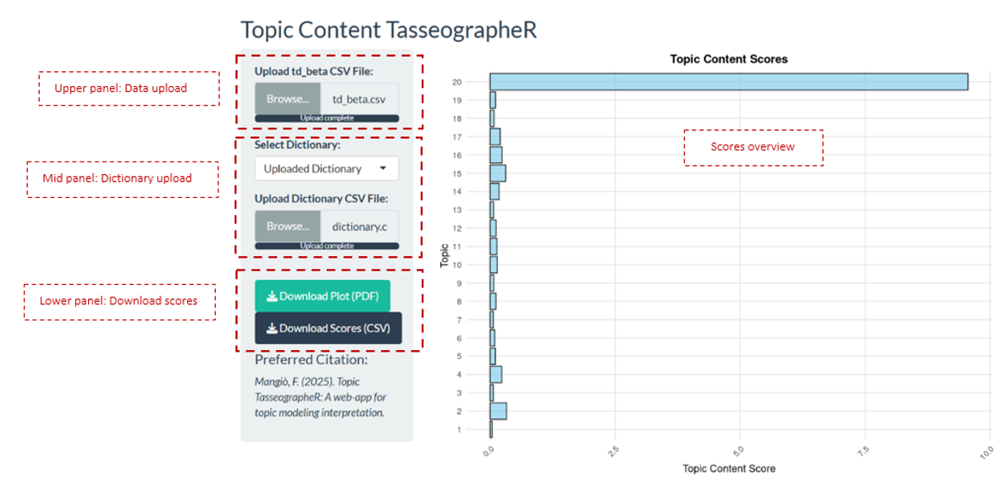

# Topic tasseographeR

**Topic tasseographeR** is an interactive, model‑agnostic R Shiny application designed to support the **interpretation and validation of topic models** through post‑hoc, dictionary‑based scoring. It provides researchers with transparent, reproducible metrics that complement human‑ and machine‑in‑the‑loop approaches to topic interpretation and validation.
Illustrative examples of this approach can be found in: Dehler-Holland, Okoh & Keles (2022) [https://doi.org/10.1016/j.techfore.2021.121354]; Mangiò, Pedeliento, Andreini & Zarantonello (2024) [https:// 10.1057/s41262-023-00347-4]; Murtas, Mangiò, Pedeliento & Manoli (2025) [https://doi.org/10.1080/16184742.2024.2424299].

---

## Overview

Interpreting topic‑model outputs is often compared to *tasseography*—the art of reading tea leaves. Topic tasseographeR addresses this challenge by computing **topic‑level dictionary scores** that quantify how strongly specific linguistic constructs are associated with individual topics.

The software consists of two complementary Shiny modules:

* **Topic Content TasseographeR**
  [https://shinyapps.io/topic_content_score/](https://shinyapps.io/topic_content_score/)

* **Topic Function TasseographeR**
  [https://shinyapps.io/topic_function_score/](https://shinyapps.io/topic_function_score/)

Both modules are web‑based, require no additional model estimation, and integrate seamlessly with existing topic‑modeling workflows in R, Python, or other environments.

---

## Conceptual framework


**Figure 1 – Topic tasseographeR workflow.**
The figure illustrates the overall protocol implemented in Topic tasseographeR. Topic models (e.g., LDA, STM, BERTopic) are first estimated externally, producing topic–word (β) and document–topic (θ) distributions. Topic tasseographeR then supports two complementary post‑hoc analyses: (1) **topic labeling and validation**, through dictionary‑based topic content and topic function scores; and (2) **aspect‑based sentiment analysis**, by applying sentiment and emotion dictionaries after topics have been rendered.

Topic tasseographeR computes two post‑hoc topic‑level metrics:

### Topic content score

The **topic content score** evaluates how strongly a predefined dictionary of *content words* is reflected in a topic’s **topic–word distribution** (β). For each topic (k), dictionary terms are matched against the topic vocabulary and weighted by their topic‑specific probabilities. Scores are aggregated at the topic level, producing a quantitative summary of how well a topic’s defining vocabulary aligns with a theoretical or empirical construct.

This metric is most appropriate when dictionary lemmas are expected to be present in the topic‑model vocabulary.

### Topic function score

The **topic function score** shifts attention from the topic–word distribution to the **document–topic distribution** (θ). It is designed to capture linguistic features—such as function words, pronouns, negations, or paralinguistic markers—that are often removed during preprocessing and therefore absent from the topic‑word distribution.

For each document, dictionary term counts are weighted by the document’s topic prevalence and then aggregated across documents to yield topic‑level scores. This metric is particularly useful for validating topics based on linguistic or psychological features excluded during model estimation.

Together, the two metrics provide complementary perspectives on topic semantics and function.

---

## Software architecture and workflow

Topic tasseographeR is **model‑agnostic** and operates independently of any specific topic‑modeling implementation.

### Inputs

Each module requires CSV files generated by an external topic‑modeling tool:

* **Topic–word distribution (β)** (`td_beta`):
  A CSV file with columns `topic`, `term`, and `beta`, representing the probability or weight of each term within each topic. Sample format: [https://docs.google.com/spreadsheets/d/1j0Z80mBdxsoMKExom660OGqZz6qc_NYtxhxZMq6zCP0/edit?usp=drive_link]

* **Document–topic distribution (θ)** (`ds`, Topic Function module only):
  A CSV file containing the original document text and one column per topic (`Topic_k`) with document‑level topic proportions. Sample format: [https://docs.google.com/spreadsheets/d/1XPLlq3G6nDGUcuBMVKZd1FSy9goc83uJzf4n0B1Zur8/edit?usp=drive_link]

### Dictionary selection

Users can:

* upload a validated dictionary as a CSV file. Sample format: [https://docs.google.com/spreadsheets/d/1LsN5_e0--hIhyJFeV4CLq_gLiQHeLUEE8HlYOPaXu0g/edit?usp=drive_link]
* define a custom dictionary directly in the interface by entering comma‑separated lemmas.

This flexibility supports both deductive validation using established lexical resources and exploratory, abductive topic labeling.

### Outputs



**Figure 2 – Topic Content TasseographeR user interface.**
The interface is organized into three functional panels. The **upper panel** allows users to upload the topic–word distribution (β). The **mid panel** supports dictionary selection, either by uploading a custom dictionary or defining lemmas directly within the interface. The **lower panel** provides controls to download topic-level scores and visualizations. The main panel displays an interactive bar chart summarizing topic content scores across topics.

* Interactive bar charts displaying topic‑level scores
* Downloadable figures (PDF)
* Downloadable numerical results (CSV)

---

## Illustrative use cases

### Topic labeling and validation

Topic tasseographeR supports both deductive and abductive approaches to topic interpretation. Researchers can test hypotheses about topic semantics using validated dictionaries (e.g., legal, religious, or pronoun‑based lexicons) and assess whether topic labels are empirically supported by dictionary scores.

### Aspect‑based sentiment analysis

The application also enables post‑hoc **aspect‑based sentiment analysis**. After estimating topics, researchers can apply multiple sentiment or emotion dictionaries sequentially—without altering the original topic solution—to assess affective dimensions associated with specific topics.

---

## Reproducibility and local execution

This repository is fully reproducible using `renv`.

```r
install.packages("renv")
renv::restore()

shiny::runApp("topic_content_score")
shiny::runApp("topic_function_score")
```

The live web applications remain available at the links above.

---

## Citation

If you use Topic tasseographeR, please cite:

> Mangiò, F. (2025). *Topic tasseographeR: An interactive R‑Shiny application to interpret and validate topic models*. University of Bergamo.

---

## License

MIT License © 2025 Federico Mangiò

---

## Contact

**Federico Mangiò**
University of Bergamo, Department of Management
Email: [Federico.mangio@unibg.it](mailto:Federico.mangio@unibg.it)
